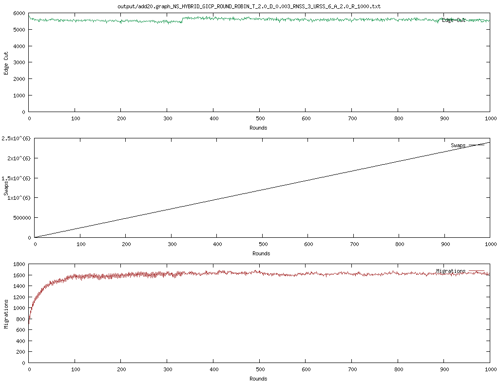
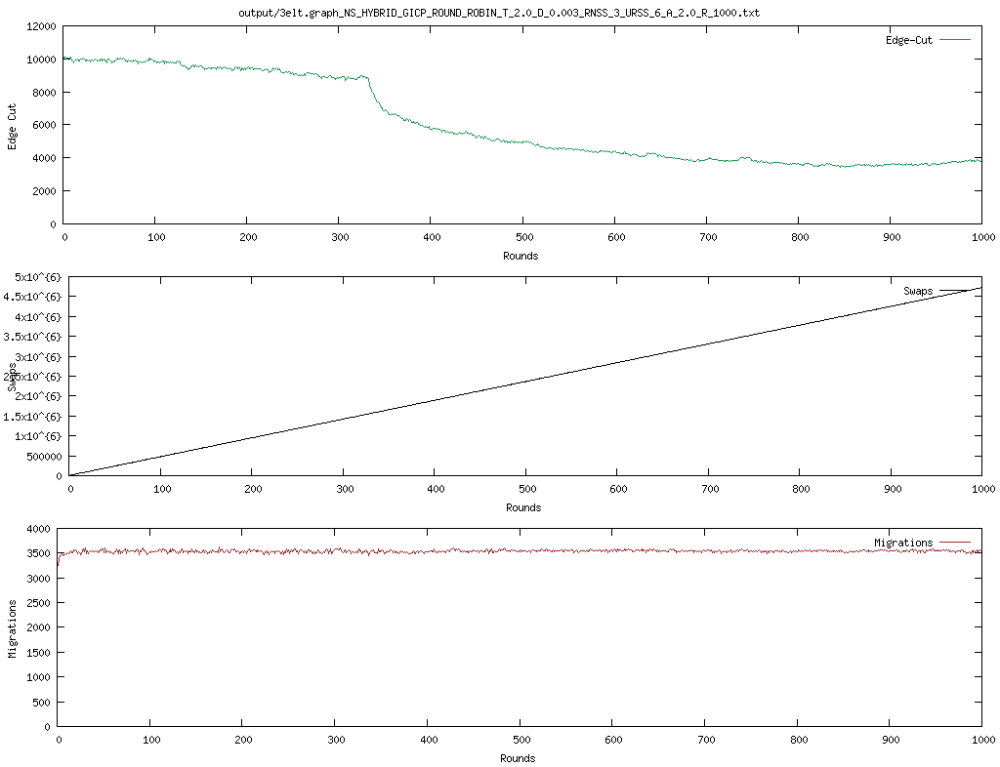
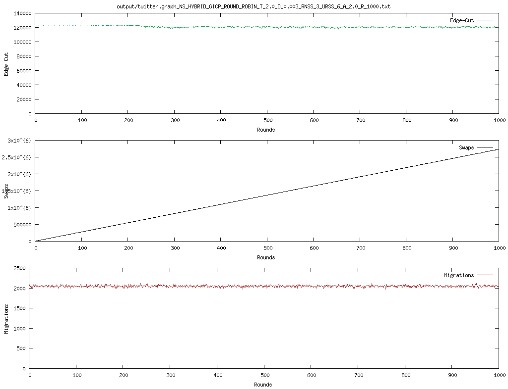
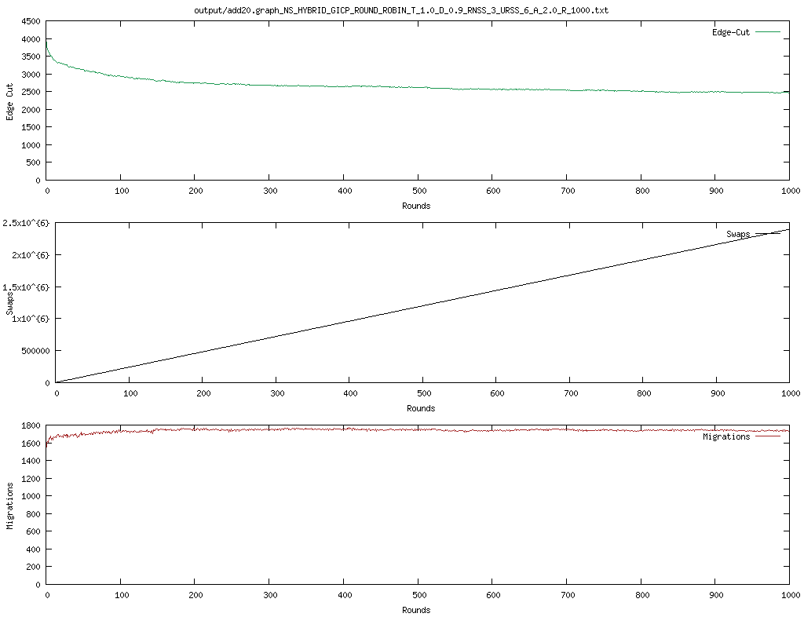
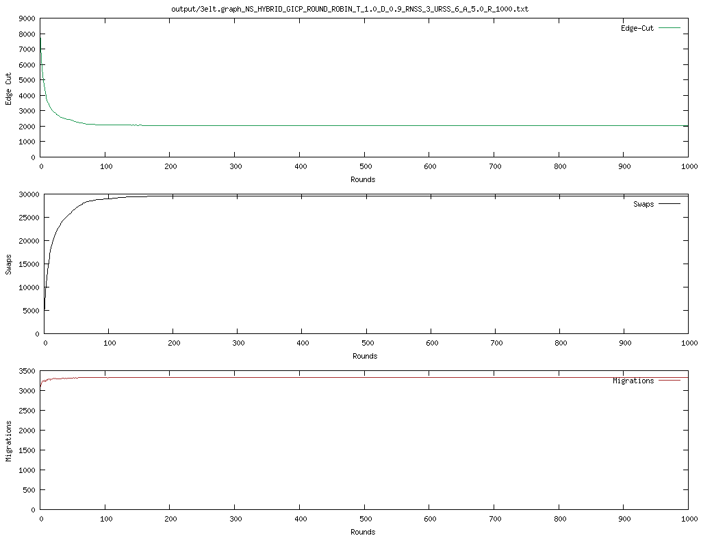
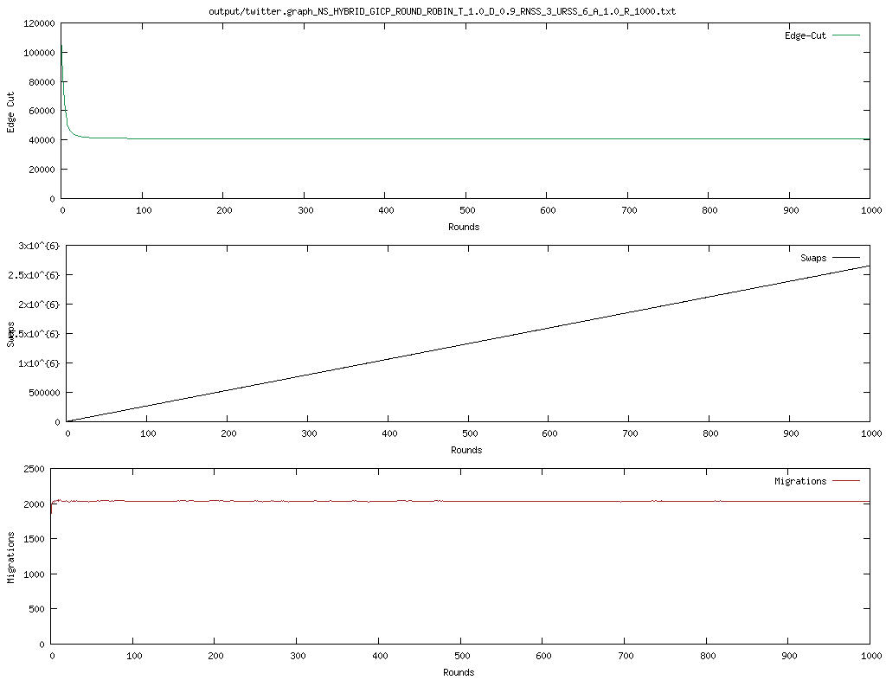
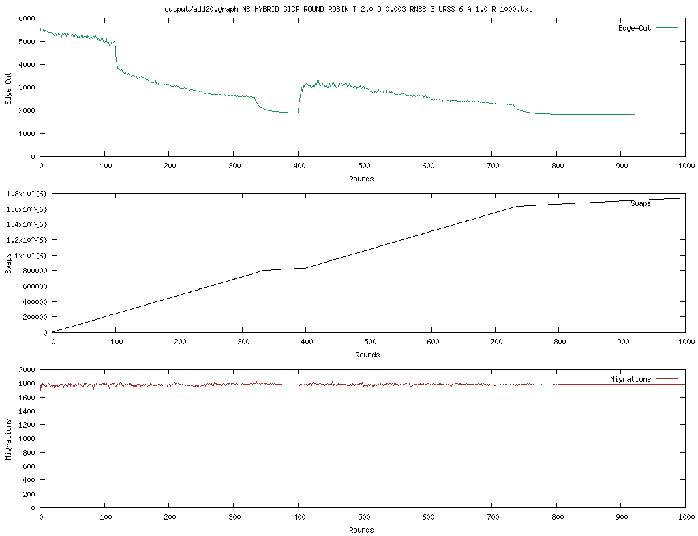
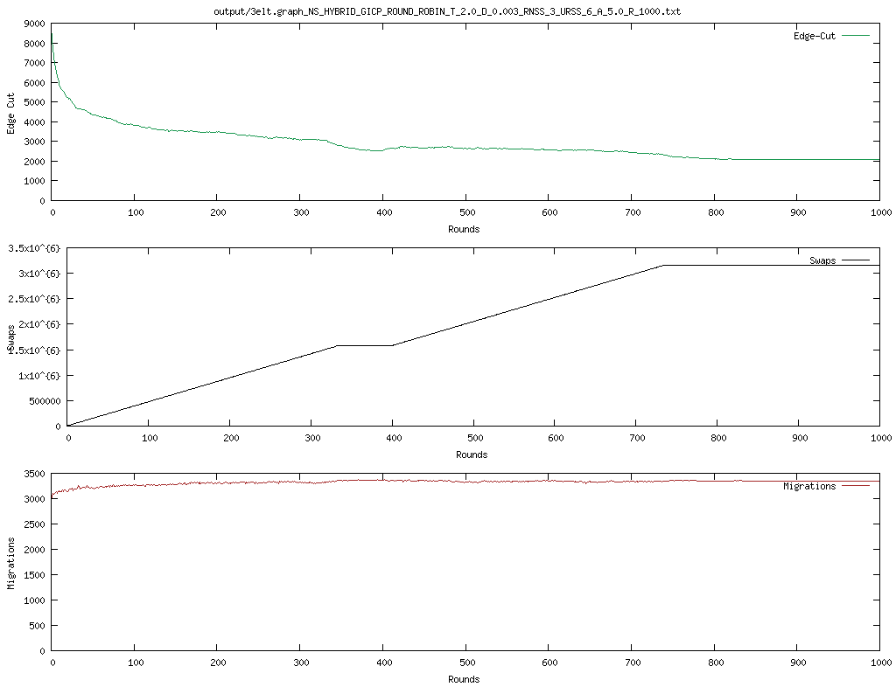
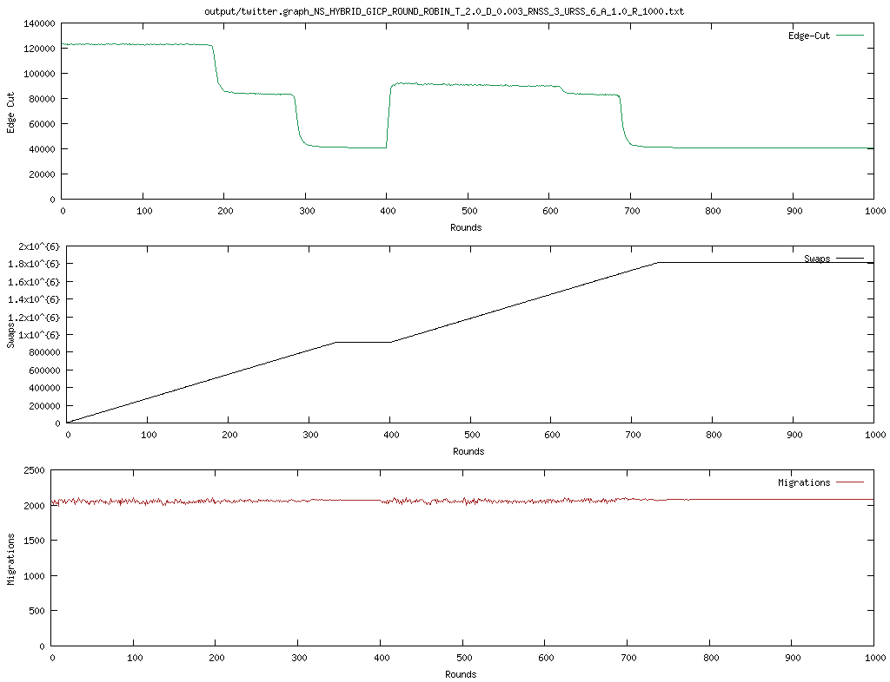

# K-way Graph Partitioning with JaBeJa

Contributors:
<a href="https://github.com/Bralli99">Brando Chiminelli</a>, 
<a href="https://github.com/boyscout99">Tommaso Praturlon</a>

Course: <a href="[https://id2223kth.github.io/](https://www.kth.se/social/course/ID2222/)">Data Mining</a>, at <a href="https://www.kth.se/en">KTH Royal Institute of Technology</a>

## How to run 
To run the program with the run.sh script
- ./compile.sh
- ./run.sh -graph {path/to/graph/}, e.g. `./run.sh -graph ./graphs/3elt.graph`
- ./plot.sh {path/to/output}, e.g. `./plot.sh output/3elt.graph_NS_HYBRID_GICP_ROUND_ROBIN_T_2.0_D_0.003_RNSS_3_URSS_6_A_2.0_R_1000.txt`

To run the program with the my_plots.sh script
- ./compile.sh
- ./my_plots.sh {**delta** value} {**temp** value} {**alpha** value} {name of the graph}, e.g. `./my_plots.sh 0.003 2.0 2.0 3elt`

## Task 1 - JaBeJa implementation
Experiments for graphs: 3elt.graph, add20.graph, facebook.graph.
The plots show the performance of JaBeJa with three different graphs, which are the same used in the paper.
The metrics which are taken into consideration are: edge-cut, swaps and data migration.
- **edge-cut** is the number of inter-partition edges, being the energy of the system.
- **swaps** is the number of inter-host swaps, indicating the cost of the algorithm.
- the number of **migrations** that occur when a node has to be moved from its initial partition to the final one.
After R=1000 rounds with hybrid (H) candidate selection policy, and simulated annealing using a linear function for the temperature decrease T = T - delta, the best edge cuts values are:

### add20 graph (2095)
With ./run.sh -delta 0.003 -alpha 2 -temp 2 -graph graphs/add20.graph

INFO  Jabeja:327 - round: 999, edge cut:**2095**, swaps: 1090263, migrations: 1751

### 3elt graph (2604)
With ./run.sh -delta 0.003 -alpha 2 -temp 2 -graph graphs/3elt.graph

INFO  Jabeja:327 - round: 999, edge cut:**2604**, swaps: 1580209, migrations: 3328

### Twitter graph (41156)
With ./run.sh -delta 0.003 -alpha 2 -temp 2 -graph graphs/twitter.graph

INFO  Jabeja:327 - round: 999, edge cut:**41156**, swaps: 899515, migrations: 2049

## Task 2 - Different JaBeJa configurations

In this task, we analyze how the algorithm's performance is affected when different parameters are changed, especially the effect of simulated annealing. In the Task 1, Ja-Be-Ja uses a linear function to decrease the temperature and the temperature is multiplied by the cost function. Now, we will analyze how changing the simulated annealing parameters, and the acceptance probability function affects the performance of Ja-Be-Ja.

### Part 1 - Implementation of Simulated Annealing
Following the description from [this](http://katrinaeg.com/simulated-annealing.html) blog post we implemented a different simulated annealing. Basically, to avoid a local maxima and instead find the global one, we calculate an **acceptance probability**. This probability is used, at random points in the process, to choose whether to accept a temporary worse solution since it could lead to a neighboring solution that leads to the gloabl maximum.

1. Generate a random solution -> in sampleAndSwap() call getNeighbors() which finds a randon neighbor partner for the node
2. Calculate its cost using the cost function -> in findPartner() use _old_ as the cost function defined in the paper
3. Generate a random neighboring solution -> use the same random partner
4. Calculate the new solution's cost -> in findPartner() use _new_ as the cost function defined in the paper
5. If the new cost is less than the old cost, move to new solution -> in findPartner() the _if_ condition
6. If new cost is more than old cost, use acceptance probability to choose old solution or not -> accept_prob is computed in findPartner() as suggested in the blog post. Then randommly assign the best partner to be the new solution.

Using the simulated annealing implementation we see that for add20 and twitter graphs the value of edge-cuts converges more rapidly, but the performance is actually slightly improved only for twitter.

### Experiments for Task 2 - Part 1
Implementation of the new simulated annealing. Observe how these changes affect the rate of convergence.
change delta = [0.8, 0.9, 0.99] and T=1.

With delta = 0.8, T=1
| graph | edge-cut expected| edge-cut obtained, alpha = 1 | edge-cut obtained, alpha = 2 | edge-cut obtained, alpha = 5 |
| --- | --- | --- | --- | --- |
| add20 | 1206 | 2468 | 2385 | 2512 |
| 3elt	| 390 | 9259 | 3551 | 3691 |
| twitter | 41040 | 40855 | 41201 | 42007 |

Print graphs to see the rate of convergence and comment it.

With delta = 0.9, T=1
| graph | edge-cut expected| edge-cut obtained, alpha = 1 | edge-cut obtained, alpha = 2 | edge-cut obtained, alpha = 5 |
| --- | --- | --- | --- | --- |
| add20 | 1206 | 2447 | **2361** | 2495 |
| 3elt	| 390 | 9203 | 3941 | **3482** |
| twitter | 41040 | **40824** | 41161 | 41946 |

With delta = 0.99, T=1
| graph | edge-cut expected| edge-cut obtained, alpha = 1 | edge-cut obtained, alpha = 2 | edge-cut obtained, alpha = 5 |
| --- | --- | --- | --- | --- |
| add20 | 1206 | 2470 | 2361 | 2479 |
| 3elt	| 390 | 9116 | 3893 | 3829 |
| twitter | 41040 | 40857 | 41187 | 41919 |

#### Best edge-cut value for add20 graph (2361)

#### Best edge-cut value for 3elt graph (3482)

#### Best edge-cut value for twitter graph (40824)

### Part 2 - Implementation of Restart
Here we investigate how the Ja-Be-Ja algorithm behaves when the simulated annealing is restarted after Ja-Be-Ja has converged. For example, if T is 2 and delta is 0.01, then after 400 rounds, the temperature will cool down to 1, and no more bad-swaps will be accepted. Ja-Be-Ja will converge soon after that. We implement the simulated-annealing restart after 400 rounds. We also experiment with different parameters and configurations to find lower edge cuts.

What we see is that with all the three graphs we experience an improvement in the performance thanks to the restart.

### Experiments for task 2 point 2
With delta = 0.003, T=2
| graph | edge-cut expected| edge-cut obtained, alpha = 1 | edge-cut obtained, alpha = 2 | edge-cut obtained, alpha = 5 |
| --- | --- | --- | --- | --- |
| add20 | 1206 | **1814** | 2057 | 2237 |
| 3elt	| 390 | 2474 | 2329 | **2071** |
| twitter | 41040 | **40969** | 41126 | 41523 |

#### Best edge-cut value for add20 graph (1814)

#### Best edge-cut value for 3elt graph (2071)

#### Best edge-cut value for twitter graph (40969)

