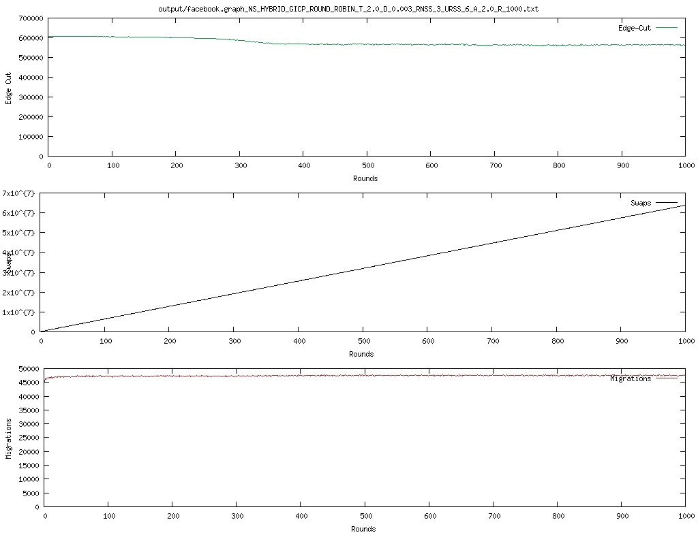

# distributed balanced k-way graph partitioning

Authors: Brando Chiminelli, Tommaso Praturlon

To run the program in Task 1 do
- ./compile.sh
- ./run.sh -graph {path/to/graph/}
- ./plot.sh {path/to/output}

## Task 1 
Experiments for graphs: 3elt.graph, add20.graph, facebook.graph.
The plots show the performance of JaBeJa with three different graphs, which are the same used in the paper.
The metrics which are taken into consideration are: edge-cut, swaps and data migration.
- edge-cut is the number of inter-partition edges, being the energy of the system.
- swaps is the number of inter-host swaps, indicating the cost of the algorithm.
- the number of migrations that occur when a node has to be moved from its initial partition to the final one.
After R=1000 rounds, the best cut

### 3elt graph
With delta set to 0.003 and T=2

### add20 graph
With delta set to 0.003 and T=2

### facebook graph
With delta set to 0.003 and T=2

## Task 2

In this task, you are to analyze how the algorithm's performance is affected when different parameters are changed, especially the effect of simulated annealing. Currently, Ja-Be-Ja uses a linear function to decrease the temperature (lines 9 - 13 of the Ja-Be-Ja algorithm), and the temperature is multiplied by the cost function (line 26 of the Ja-Be-Ja algorithm). You will now analyze how changing the simulated annealing parameters, and the acceptance probability function affects the performance of Ja-Be-Ja.

Implementation of simulated annealing, following the description from [this](http://katrinaeg.com/simulated-annealing.html) blog post. Basically, to avoid a local maxima and instead find the global one, we calculate an **acceptance probability**. This probability is used, at random points in the process, to choose whether to accept a temporary worse solution since it could lead to a neighboring solution that leads to the gloabl maximum.

1. Generate a random solution -> in sampleAndSwap() call getNeighbors() which finds a randon neighbor partner for the node
2. Calculate its cost using the cost function -> in findPartner() use _old_ as the cost function defined in the paper
3. Generate a random neighboring solution -> use the same random partner
4. Calculate the new solution's cost -> in findPartner() use _new_ as the cost function defined in the paper
5. If the new cost is less than the old cost, move to new solution -> in findPartner() the _if_ condition
6. If new cost is more than old cost, use acceptance probability to choose old solution or not -> accept_prob is computed in findPartner() as suggested in the blog post. Then randommly assign the best partner to be the new solution.

# Experiments
At round 1000
Task 2 point 1 -> implementation of the new simulated annealing. Observe how these changes affect the rate of convergence.
## 3elt graph
delta = 0.003, T_alpha = 0.8, T=1 -> edge cut: , swaps: , migrations: 
delta = 0.003, T_alpha = 0.9, T=1 -> edge cut: 3851, swaps: 4718934, migrations: 3501 
delta = 0.003, T_alpha = 0.99, T=1 -> edge cut: , swaps: , migrations: 
## add20 graph
delta = 0.003, T_alpha = 0.8, T=1 -> edge cut: , swaps: , migrations: 
delta = 0.003, T_alpha = 0.9, T=1 -> edge cut: 2503, swaps: 2393070, migrations: 1734 
delta = 0.003, T_alpha = 0.99, T=1 -> edge cut: , swaps: , migrations: 
## facebook graph
delta = 0.003, T_alpha = 0.8, T=1 -> edge cut: , swaps: , migrations: 
delta = 0.003, T_alpha = 0.9, T=1 -> edge cut: , swaps: , migrations: 
delta = 0.003, T_alpha = 0.99, T=1 -> edge cut: , swaps: , migrations: 

Task 2 point 2 -> change T and delta to find lower cuts. 
